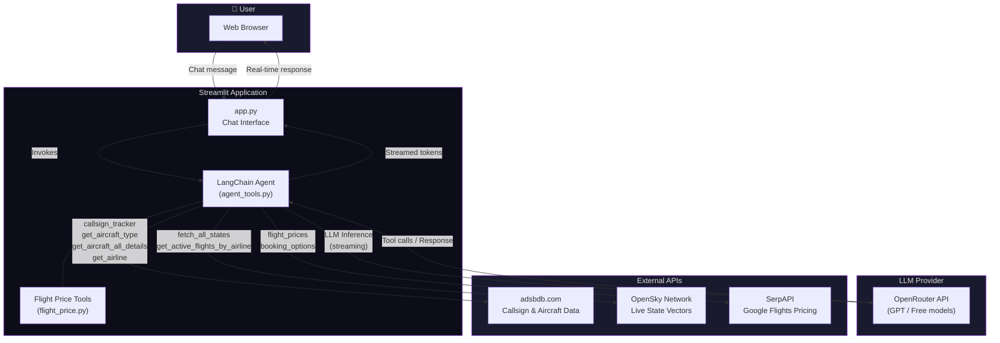
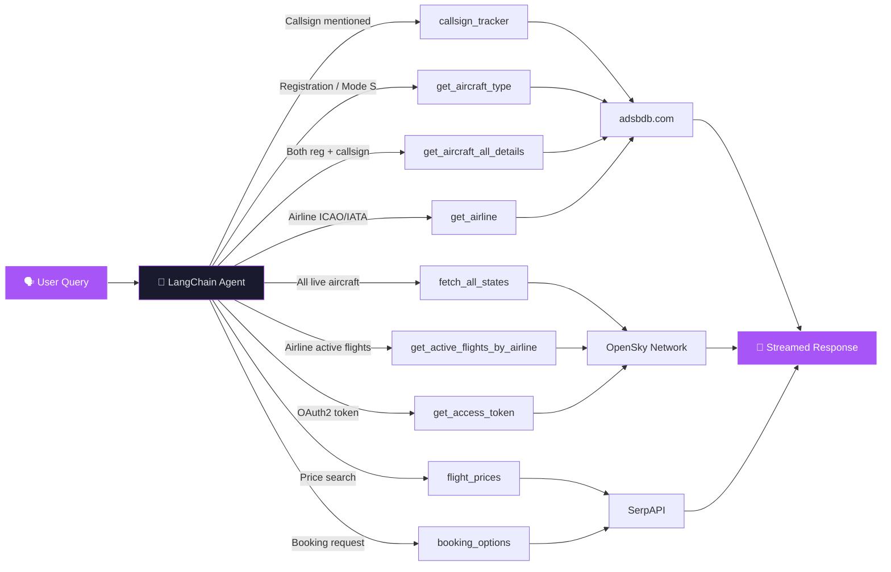
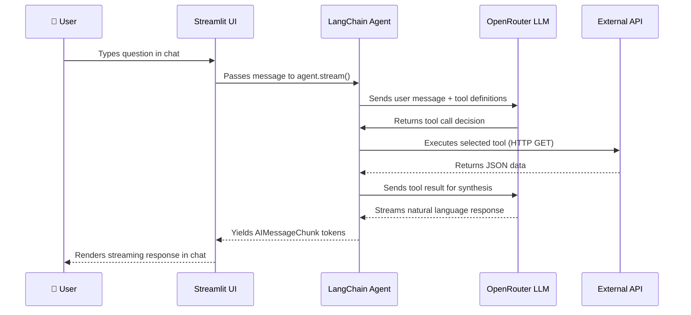

<


---

## 🚀 Features

| Feature | Description |
|---------|-------------|
| 🔍 **Callsign Tracking** | Look up live flight data by callsign (e.g. `UAL123`) |
| 🛩️ **Aircraft Lookup** | Query aircraft details by registration number or Mode S transponder code |
| 🏢 **Airline Info** | Retrieve airline details by ICAO or IATA code |
| 🌐 **Live State Vectors** | Fetch all currently airborne aircraft via the OpenSky Network API |
| 📊 **Flights by Airline** | Filter live flights by airline ICAO prefix (e.g. all `AAL` flights) |
| 💰 **Flight Prices** | Search one-way or round-trip fares via Google Flights (SerpAPI) |
| 🎫 **Booking Options** | Retrieve booking links and options for a selected flight |
| 🗓️ **Relative Dates** | Say "tomorrow" or "next Friday" — the agent resolves the exact date automatically |
| ⚡ **Streaming Responses** | Token-by-token streaming directly in the chat UI |

---

## 🏗️ Architecture

### High-Level System Architecture



### Agent Tool Routing Flow



### Data Flow Sequence



---

## 📂 Project Structure

```
ai-flight-tracker/
├── app.py                  # Streamlit chat UI & streaming logic
├── agent_tools.py          # LangChain agent, LLM config & tool definitions
├── flight_price.py         # SerpAPI-based flight price & booking tools
├── requirements.txt        # Python dependencies
├── .env                    # API keys (not committed)
├── .gitignore              # Git ignore rules
├── .streamlit/
│   └── config.toml         # Custom dark purple theme
└── .devcontainer/
    └── devcontainer.json   # GitHub Codespaces / VS Code configuration
```

---

## 🔌 APIs Used

| API | Purpose | Auth Required | Used By |
|-----|---------|---------------|---------|
| [adsbdb.com](https://www.adsbdb.com/) | Callsign, aircraft & airline lookup | None | `agent_tools.py` |
| [OpenSky Network](https://opensky-network.org/) | Live aircraft state vectors | Optional (OAuth2 for higher rate limits) | `agent_tools.py` |
| [SerpAPI](https://serpapi.com/) | Google Flights prices & booking | API Key (`SERPAPI_KEY`) | `flight_price.py` |
| [OpenRouter](https://openrouter.ai/) | LLM inference (GPT, Claude, etc.) | API Key (`OPENROUTER_API_KEY`) | `agent_tools.py` |

---

## 🛠️ Setup

### Prerequisites

- **Python 3.11+**
- An [OpenRouter](https://openrouter.ai/) API key (free tier available)
- A [SerpAPI](https://serpapi.com/) API key (for flight pricing features)

### 1. Clone the repository

```bash
git clone https://github.com/iamkavin1674/ai-flight-tracker.git
cd ai-flight-tracker
```

### 2. Create a virtual environment

```bash
python -m venv venv

# Windows
venv\Scripts\activate

# macOS / Linux
source venv/bin/activate
```

### 3. Install dependencies

```bash
pip install -r requirements.txt
```

### 4. Configure environment variables

Create a `.env` file in the project root:

```env
OPENROUTER_API_KEY=your_openrouter_api_key_here
SERPAPI_KEY=your_serpapi_key_here
```

> [!NOTE]
> The `.env` file is listed in `.gitignore` and will never be committed to source control.

### 5. Run the app

```bash
streamlit run app.py
```

The app will be available at **http://localhost:8501** 🎉

---

## ☁️ GitHub Codespaces

This project is fully configured for **GitHub Codespaces** via the `.devcontainer` setup:

1. Click the green **"Code"** button on the repo → **"Open with Codespaces"**
2. Dependencies install automatically via `requirements.txt`
3. Streamlit launches on port `8501` with auto-preview

> [!TIP]
> Remember to add your `OPENROUTER_API_KEY` and `SERPAPI_KEY` as [Codespaces Secrets](https://docs.github.com/en/codespaces/managing-your-codespaces/managing-encrypted-secrets-for-your-codespaces) for a seamless experience.

---

## 💬 Example Queries

| Query | Tool(s) Invoked |
|-------|-----------------|
| `Track flight UAL123` | `callsign_tracker` |
| `What aircraft is registration N12345?` | `get_aircraft_type` |
| `Tell me about airline DLH` | `get_airline` |
| `Show me all active Air India flights` | `get_active_flights_by_airline` |
| `Cheapest flights from JFK to LAX tomorrow?` | `flight_prices` |
| `I want to book that flight` | `booking_options` |
| `Show all flights in the sky right now` | `fetch_all_states` |

---

## 📦 Dependencies

| Package | Purpose |
|---------|---------|
| `streamlit` | Web UI framework with chat components |
| `langchain` | Agent & tool orchestration framework |
| `langchain-core` | Core LangChain primitives (`AIMessageChunk`, etc.) |
| `langchain-openrouter` | OpenRouter LLM integration for LangChain |
| `langchain-ollama` | Local Ollama LLM support (alternative backend) |
| `openrouter` | OpenRouter Python SDK & error types |
| `python-dotenv` | `.env` file loading |
| `requests` | HTTP calls to flight APIs |

---

## 🎨 Theme

The app uses a custom dark purple theme defined in [`.streamlit/config.toml`](.streamlit/config.toml):

| Property | Value | Preview |
|----------|-------|---------|
| Background | `#0d0d1a` | 🟣 Deep navy |
| Secondary BG | `#1a1a2e` | 🔵 Dark indigo |
| Primary Accent | `#a855f7` | 💜 Purple |
| Text | `#e0e0e0` | ⚪ Light gray |
| Font | `sans serif` | — |

---

## 🤝 Contributing

Contributions are welcome! Here's how to get started:

1. **Fork** the repository
2. **Create** a feature branch: `git checkout -b feature/my-feature`
3. **Commit** your changes: `git commit -m 'Add my feature'`
4. **Push** to your branch: `git push origin feature/my-feature`
5. **Open** a Pull Request

---

## 📄 License

This project is open-source. Feel free to use, fork, and contribute!

---

<p align="center">
  Built with ❤️ using <b>LangChain</b>, <b>Streamlit</b>, and <b>OpenRouter</b>
</p>
]]>
